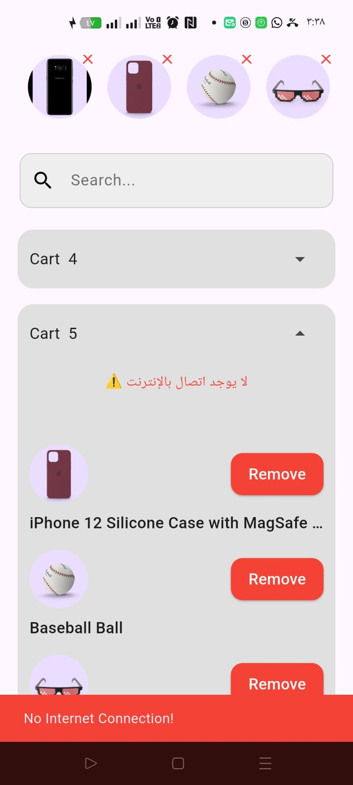
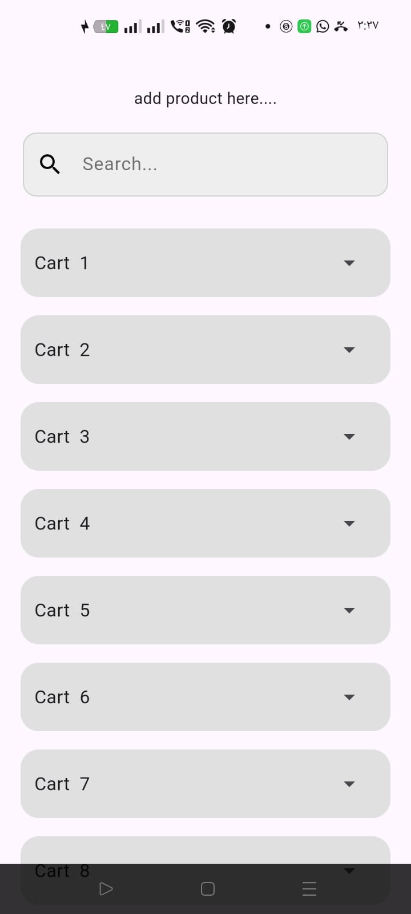
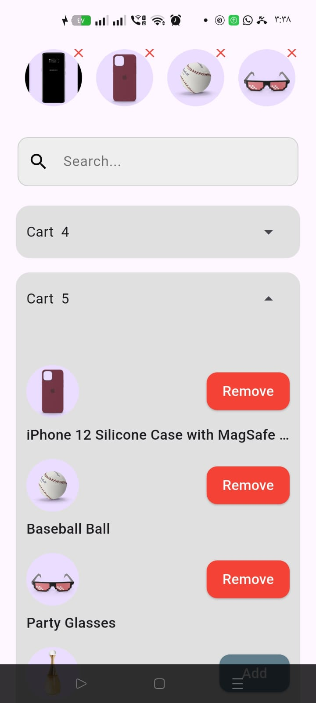

# 🛍️ E-Commerce App

A modern Flutter E-Commerce application that allows users to **add**, **delete**, and **view products** with smooth pagination and internet connection handling.

## 🚀 Features

- 🧩 **Add Product:** Add new products with all necessary details.
- 🗑️ **Delete Product:** Easily remove products from the list.
- 📜 **Pagination:** Load products efficiently page by page.
- 🌐 **Internet Connection Handling:** Detects and manages network status gracefully.
- 💎 **Clean UI:** Modern and user-friendly interface.
- ⚙️ **Flutter + BLoC Architecture:** Organized and scalable project structure.

---

## 📸 Screenshots

| Add Product | Product List | E-Commerce Home |
|--------------|---------------|----------------|
|  |  |  |

---

## 🧠 Technologies Used

- **Flutter** 💙
- **Dart**
- **BLoC / Cubit State Management**
- **HTTP / Dio for APIs**
- **Connectivity Plus** for internet detection

---

## 🛠️ Getting Started
